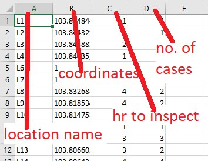
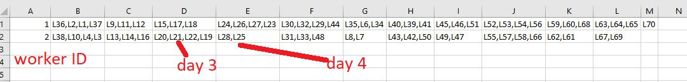

# GET1031

This project is used for our school project where we calculate distances from point to point. Currently, it is very slow with a `O(n^2)` peformance and has duplicate records.

## How To Use

Install Node dependencies
```
npm install
```

Compile TypeScript files
```
tsc
```

Provide CSV file `data.csv` in format (point name, coordinates - "0.01,0.4234", hours to inspect, no. of cases) into `dist/` directory. An example is shown in the following image.



Then run the `index.js` file.
```
node dist/index.js
```

It will now output a `my.csv` file in your `dist/` directory. This file is the distance table of all locations.

There will also be a `schedule.csv` file that is generated based on worker available, prioritizing number of cases.


